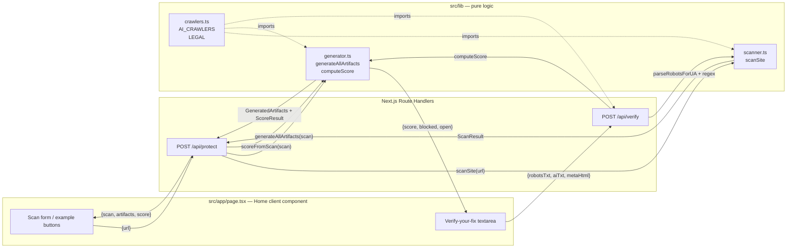

# Architecture Overview

**Don't Train On Me** is a single-page [Next.js](https://nextjs.org/) 15 / [React](https://react.dev/) 19 web application that measures a website's exposure to known AI training crawlers, generates deployable machine-readable opt-out artifacts, scores the resulting protection posture on a fixed 0–100 scale, and lets a creator verify a deployed fix by re-scoring pasted artifacts.

The product exists to close an information asymmetry between creators and AI trainers: the legal research in [Legal Foundations](../research/legal-foundations.md) establishes that a machine-readable rights reservation (EU DSM Directive Art. 4(3)) plus an opt-out obligation on GPAI providers (EU AI Act Art. 53(1)(c)) is the closest thing today to a legally backed "don't train on me" — but only if the signals are published correctly. The app makes that a 60-second operation.

## Pipeline

The application is a clean four-stage pipeline with two user-facing entry points. There are no databases, no accounts, and nothing is stored: every scan is stateless and reproducible from the live target site.



### The protect flow (scan a live site)

1. **Input** — The user enters a domain (or clicks an example button) in [the scan UI](../ui/page.md). The client component POSTs `{ url }` to [`POST /api/protect`](../api/protect-route.md).
2. **Scan** — The route handler calls [`scanSite`](../lib/scanner.md) in `src/lib/scanner.ts`, which in parallel fetches `/robots.txt`, the homepage HTML, and `/ai.txt` from the live origin (8 s timeout, custom `User-Agent`), then parses the robots file with RFC 9309 group semantics and extracts `noai`/`noimageai`/`notranslate` meta tags from the homepage.
3. **Generate** — [`generateAllArtifacts`](../lib/generator.md) in `src/lib/generator.ts` turns the `ScanResult` into a robots.txt block snippet, a full `/ai.txt`, a `<meta>` tag, and a legal notice — each embedding the [EU Art. 4(3) reservation](../lib/crawlers.md) from the `LEGAL` constant.
4. **Score** — `scoreFromScan` computes a weighted 0–100 score across four fixed bands (50 crawler coverage, 20 meta tags, 15 ai.txt, 15 reachability).
5. **Response** — The handler returns `{ scan, artifacts, score }`; the UI renders the verdict, the evidence grid, the copy-able fix, and the verify-your-fix panel.

The handler sets `export const runtime = "nodejs"` because `scanSite` uses the Node-global `fetch` with `AbortSignal.timeout`; the Edge runtime does not provide that.

### The verify flow (re-score a deployment)

The verify-your-fix panel lets a creator paste the artifacts they actually deployed and get a before/after score using the **same scoring function** as the protect flow. The client POSTs `{ robotsTxt, aiTxt, metaHtml }` to [`POST /api/verify`](../api/verify-route.md), which reuses [`parseRobotsForUA`](../lib/scanner.md) on the pasted robots text, runs regex checks for the ai.txt and meta signals, and calls `computeScore` with `reachable: true` (pasted content is definitionally "deployed"). This is the key decoupling: [`ScoreInput`](../lib/generator.md) exists so that the verify route scores identically without a live fetch.

## Module boundaries

| Layer | Path | Responsibility | Key symbols |
|---|---|---|---|
| UI | `src/app/page.tsx` | Single-page client component; scan input, 8 numbered result modules, honesty module, verify-your-fix | `Home`, `ScanResponse`, `VerifyResponse` |
| UI shell | `src/app/layout.tsx` | Root layout + `<head>` metadata | `RootLayout`, `metadata` |
| Styling | `src/app/globals.css` | Teenage Engineering-inspired design system | `:root` tokens, `.card`, `.score-big`, `.chip`, `.skeleton-*` |
| API | `src/app/api/protect/route.ts` | Protect orchestrator | `POST` |
| API | `src/app/api/verify/route.ts` | Verify re-scoring | `POST` |
| Data | `src/lib/crawlers.ts` | The 19-crawler blocklist + legal text | `AICrawler`, `AI_CRAWLERS`, `LEGAL` |
| Logic | `src/lib/scanner.ts` | Live site inspection + RFC 9309 parser | `scanSite`, `parseRobotsForUA`, `extractMetaTags`, `ScanResult` |
| Logic | `src/lib/generator.ts` | Artifact generation + weighted score | `generateAllArtifacts`, `computeScore`, `scoreFromScan`, `ScoreInput` |

The `@/*` path alias (configured in `tsconfig.json` → `./src/*`) is used by both API routes to import the lib modules; the lib modules use relative `./` imports internally. `next.config.mjs` enables `reactStrictMode`.

## Invariants

- **Statelessness** — No persistence. Every request re-fetches the live site; `scannedAt` is generated at scan time (`new Date().toISOString()`).
- **No dependencies** — `scanner.ts` uses the global `fetch` and `AbortSignal`; the lib layer adds zero npm dependencies beyond Next/React.
- **Graceful unreachability** — If `fetchText` returns `null` (timeout, non-2xx, network error), `scanSite` marks `reachable: false` but still returns a complete `ScanResult` with all crawlers in `openCrawlers`; the [generator](../lib/generator.md) still produces valid artifacts (`toBlock` falls back to all crawlers), and the [UI](../ui/page.md) shows a warning that the score is worst-case while the artifacts remain deployable.
- **Score reproducibility** — The 50/20/15/15 weights are fixed in `computeScore` and shared by both flows via the `ScoreInput` decoupling.
- **Honor-system honesty** — The honesty module in the UI states plainly that these signals bind only compliant crawlers and cannot stop a scraper that ignores `robots.txt`; the only complete protection is access control. See [Legal Foundations](../research/legal-foundations.md).

## Lifecycle and trust

The whole product is a stateless request/response lifecycle — there is no background queue, no scheduled job in the app (the only scheduled workflow is the OpenWiki self-refresh in `.github/workflows/openwiki-update.yml`, which is documentation tooling, not product logic). Trust is established by linking every scan result to the raw evidence (the live `robots.txt`) with a UTC timestamp, by publishing the fixed score weights, and by the honesty module that refuses to overclaim.

## Build and run

```bash
npm install
npm run dev      # http://localhost:3000
npm run build    # production build
npm run lint     # next lint
```

The repository has no test suite; the [quickstart](../quickstart.md) lists the manual validation that exercises the two flows.

## Scope boundaries

- **What it does**: measure exposure against the 19 crawlers in [the blocklist](../lib/crawlers.md), publish EU Art. 4(3) reservations, create an Art. 53(1)(c) compliance duty, verify a deployed configuration.
- **What it does not**: physically stop non-compliant scrapers, audit what a model was trained on, detect post-training misuse, or provide legal advice. These limits are documented in the UI honesty module and grounded in [the research](../research/legal-foundations.md).
- **Roadmap (not built)**: Spawning DO NOT TRAIN registry submission, C2PA content signing, one-click deploy — see [quickstart Backlog](../quickstart.md).
