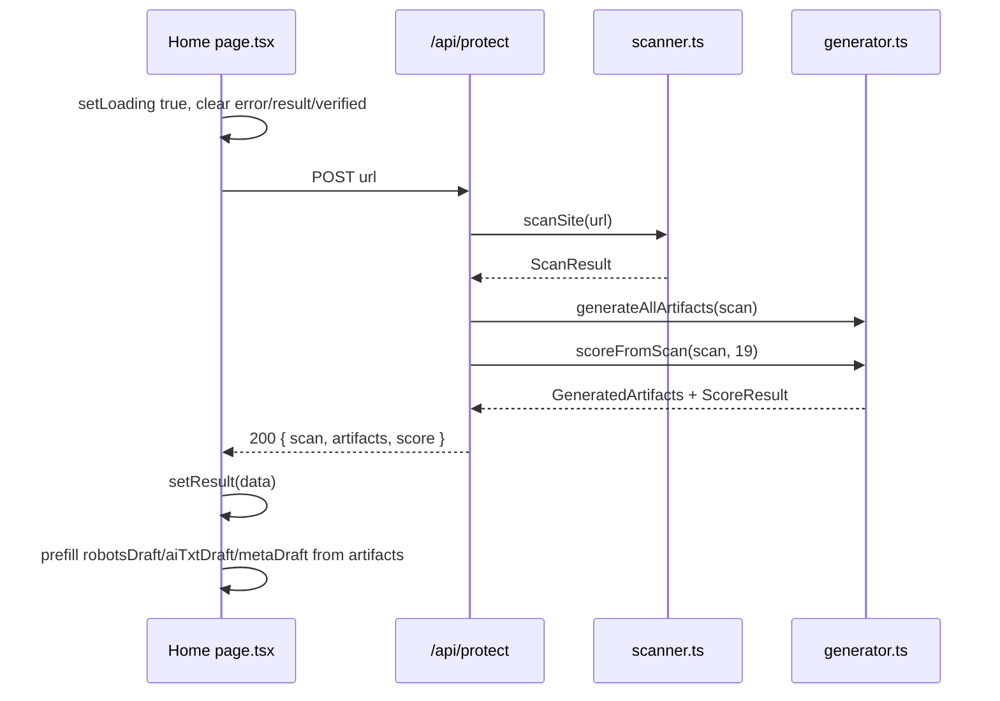

# Scan UI & Verify-Your-Fix Page

`src/app/page.tsx` is the entire user-facing surface of the application: a single React client component (`"use client"`) that holds the scan input, the 8 numbered result modules, the honesty module, and the verify-your-fix before/after flow. It is the only consumer of [`POST /api/protect`](../api/protect-route.md) and [`POST /api/verify`](../api/verify-route.md).

## Component shape

The default export `Home()` is a client component (it uses `useState` and `navigator.clipboard`). It holds three groups of state:

| State | Purpose |
|---|---|
| `url`, `loading`, `error`, `result` | Scan flow: the input, in-flight flag, error string, and parsed `ScanResponse` |
| `robotsDraft`, `aiTxtDraft`, `metaDraft` | The verify-your-fix textareas, prefilled from `result.artifacts` on a successful scan |
| `verifying`, `verifyError`, `verified` | Verify flow: in-flight, error, and parsed `VerifyResponse` |

## Wire types

The component declares the shapes it expects from the two routes (they mirror the route contracts):

```ts
type ScanResponse = {
  scan: { url, reachable, robotsFound, blockedCrawlers, openCrawlers, metaTagsFound, aiTxtFound, scannedAt };
  artifacts: { robotsSnippet, fullRobotsTxt, aiTxt, metaTags, legalNotice };
  score: ScoreResult;
};
type VerifyResponse = { score: ScoreResult; blockedCrawlers: string[]; openCrawlers: string[] };
type ScoreResult = { score: number; breakdown: { label: string; got: number; max: number }[] };
```

## The two fetch flows

### `runScan(target)` — the protect flow



On any error (non-`res.ok`, network, thrown) it sets `error` to `data.error ?? "Scan failed"` (or the thrown message). The `finally` clears `loading`. The form submit (`handleScan`) and example buttons both call `runScan`; example buttons also `setUrl` first so the input reflects the choice.

### `handleVerify()` — the verify flow

POSTs `{ robotsTxt: robotsDraft, aiTxt: aiTxtDraft, metaHtml: metaDraft }` to `/api/verify`. The three drafts are **prefilled from the generated artifacts** the moment a scan succeeds (`setRobotsDraft(data.artifacts.fullRobotsTxt)`, etc.), so a creator can immediately paste what they deployed or edit it. On success it sets `verified` to the `{ score, blockedCrawlers, openCrawlers }` response.

## The 8 numbered modules

When `result` is set and `loading` is false, the component renders (gated by `!loading`):

| # | Module | Source field | Render |
|---|---|---|---|
| 02 | VERDICT | `result.scan.url`, `result.score`, `result.scan.scannedAt` | The big LCD score (`scoreClass`), the `breakdown` list, a method note |
| 03 | EVIDENCE | `result.scan.blockedCrawlers` + `openCrawlers` | A `.crawler-grid` of `.chip` rows with green/red LEDs and `BLOCKED` / `CAN TRAIN` state, plus an `EvidenceLink` to the live `robots.txt` |
| 04 | THE FIX | `result.artifacts.fullRobotsTxt` | A `<pre>` of the robots block with a `CopyButton`; a note on EU Art. 4(3) |
| 05 | VERIFY THE FIX | `robotsDraft` / `aiTxtDraft` / `metaDraft` | The verify-your-fix textareas + `Re-score deployment` button; on `verified` renders the before/after row |
| 06 | /AI.TXT | `result.artifacts.aiTxt` | A `<pre>` with a `CopyButton` |
| 07 | META TAGS | `result.artifacts.metaTags` | A `<pre>` with a `CopyButton` |
| 08 | LEGAL NOTICE | `result.artifacts.legalNotice` | A `<pre>` with a `CopyButton` |

Module `01` is the scan form (always rendered above the result). Module `§` is the honesty module (below the result). The numbering is the Teenage Engineering "numbered module" aesthetic — see [Design System](../ui/design-system.md).

### Unreachable-site warning

When `result.scan.reachable` is false, the component renders a red `.error` banner above module 02: "Site unreachable — score shown is worst-case. Generated artifacts below remain valid to deploy." This reflects the [graceful-unreachability invariant](../architecture/overview.md#invariants): the [generator](../lib/generator.md) still produced deployable artifacts even though the site was down.

## `scoreClass(score)`

Maps a numeric score to a CSS class for the LCD readout color: `>= 80` → `score-good` (green), `>= 40` → `score-mid` (yellow `#ffd60a`), else `score-bad` (orange). Used for both the verdict score and the before/after scores in the verify row.

## Helper components

- **`CopyButton({ text })`** — copies `text` to the clipboard via `navigator.clipboard.writeText`, shows "copied ✓" for 1.5 s, then resets. Reused on modules 04, 06, 07, 08.
- **`EvidenceLink({ url, path })`** — renders an `view live ↗` anchor to `${url}${path}` (e.g. `https://en.wikipedia.org/robots.txt`) with `target="_blank" rel="noreferrer noopener"`. Used on module 03 so every claim links to the raw evidence — the [verifiability-over-assertion trust principle](../architecture/overview.md#lifecycle-and-trust).
- **`SkeletonCard()`** — the loading placeholder rendered when `loading` is true: a "SCANNING…" card with a blinking `.skeleton-line` and a 12-cell `.skeleton-grid` of `.skeleton-chip` placeholders.

## `EXAMPLES`

Two example buttons that populate the input and immediately run a scan:

| Label | URL | Demonstrates |
|---|---|---|
| `en.wikipedia.org — unprotected` | `en.wikipedia.org` | Low score, wall of red "CAN TRAIN" chips |
| `www.theverge.com — partial` | `www.theverge.com` | A mid-range partial-protection score |

Both are disabled while `loading` is true.

## Honesty module

A persistent `.trust-card` (module `§`) rendered after the result, not gated on `loading`. It has two columns:

- **✓ Can** — measure exposure against 19 crawlers; publish EU DSM Art. 4(3) reservations; create Art. 53(1)(c) compliance duties; verify a deployed configuration with evidence links. The "19" here is a **hardcoded literal in the UI** (`"Measure exposure against 19 documented AI training crawlers"`); it is not derived from `AI_CRAWLERS.length`, so if the [blocklist](../lib/crawlers.md#the-ai_crawlers-blocklist) grows or shrinks this string must be updated by hand (the score's `totalCrawlers` denominator, by contrast, auto-scales because it uses `AI_CRAWLERS.length`).
- **✗ Cannot** — physically stop a scraper that ignores `robots.txt`; audit what a model was trained on; detect post-training misuse; replace legal advice.

A footnote adds: "The only complete protection is access control: content that was never fetched cannot be trained on." This is the [honest-limits trust principle](../architecture/overview.md#lifecycle-and-trust) and is grounded in [Legal Foundations](../research/legal-foundations.md).

## Upstream and downstream

- **Upstream** — rendered by the [root layout](../ui/design-system.md) (`src/app/layout.tsx`) which provides `<html>`/`<body>` and the `<head>` metadata.
- **Downstream** — calls [`POST /api/protect`](../api/protect-route.md) (`runScan`) and [`POST /api/verify`](../api/verify-route.md) (`handleVerify`). Styled entirely by [the design system](../ui/design-system.md).

## Scope boundary

The page contains no scanning, generating, or scoring logic — it is a presentation and fetch-orchestration layer over the two API routes. The artifacts and score come from the routes; the page only renders them and wires the verify drafts.
